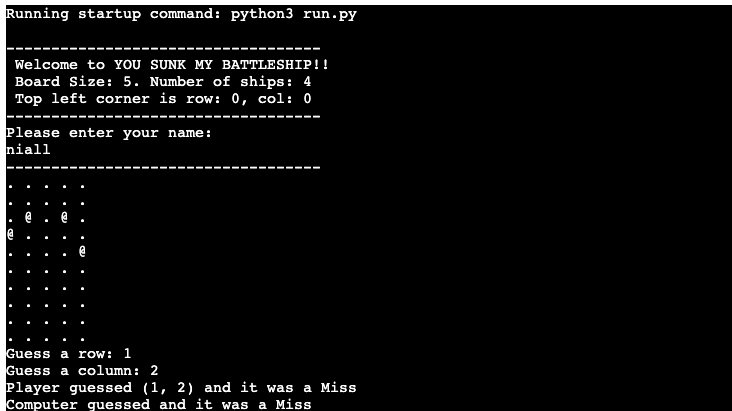

Welcome to "You Sunk My Battleship!" This is a simple console-based implementation of the classic Battleship game, where you can play against the computer. The objective is to guess the locations of the opponent's ships and sink them before they sink yours.

## How to Play

1. **Start the Game**: Run the script to start the game. You will be prompted to enter your name.
2. **Game Board**: The game board is a 5x5 grid. The top left corner is (0, 0).
3. **Place Ships**: The computer and the player will place their ships randomly on their respective boards.
4. **Make a Guess**: On your turn, input the coordinates (row and column) to guess where the computer's ships are located.
5. **Hit or Miss**: The game will indicate whether your guess was a hit or a miss. The computer will also make guesses on your board.
6. **Win the Game**: The game continues until all ships of one player are sunk. The player who sinks all the opponent's ships first wins.

## Features

- Random placement of ships on the board.
- Turn-based guessing system between the player and the computer.
- Real-time display of the game board after each guess.
- Score tracking to keep track of hits for both the player and the computer.

## Data Model

The game is primarily managed through the `Board` class, which includes:

- `size`: The size of the board (5x5 grid).
- `board`: A 2D list representing the game board.
- `num_ships`: The number of ships on the board.
- `name`: The name of the player.
- `type`: The type of the board (player or computer).
- `guesses`: A list of guesses made.
- `ships`: A list of ship coordinates.

## Validator Testing
- PEP8
No errors were returned from PEP8online.com

## Existing features
- Random board generation
- Play against the computer
- Keeps scores

Credits
- Code Institute walkthrough videos.
- [Video tutorial](https://www.youtube.com/watch?v=tF1WRCrd_HQ&t=6s)
- ChatGPT to help troubleshoot deployment but no luck.