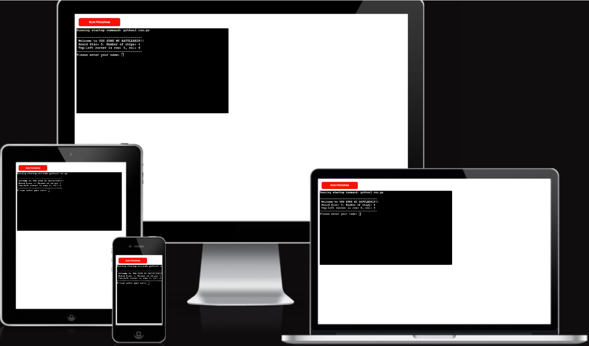

# You Sunk My Battleship!

**You Sunk My Battleship!** is a simple console-based version of the classic Battleship game, where you and the computer each have 4 ships hidden on a 5×5 grid. The objective is to guess the opponent’s ship locations and sink them all before they sink yours.

---

## How to Play

 

1. **Start the Game**  
   - Run the Python file (`python3 run.py`) in your terminal.
   - Enter your name when prompted.

2. **Board Setup**  
   - Both you and the computer have a 5×5 board.
   - Each board randomly places 4 single-square ships.

3. **Turns & Guesses**  
   - On your turn, enter a row and column (both 0-based) to guess where the computer’s ships might be.  
   - The computer then guesses on your board.

4. **Hits & Misses**  
   - A correct guess is marked with `*`.  
   - An incorrect guess is marked with `x`.  

5. **Winning**  
   - The game ends when either you or the computer has 4 hits (one for each ship).  
   - If you hit all of the computer’s ships first, you win!

---

## Features

- **Random Ship Placement**  
  Each board has 4 randomly placed ships at the start of the game.  

- **Turn-Based Gameplay**  
  You and the computer alternate guesses until one side’s ships are all sunk.

- **Input Validation**  
  - Prevents guessing the same spot more than once.  
  - Ensures guesses are within the 5×5 grid.  
  - Accepts only numeric input for row and column.

- **Score Tracking**  
  - Each successful hit increments the hits counter.  
  - The game immediately ends when hits == number of ships (4).

---

## Data Model

All game logic is handled via a `Board` class:

- `size` — The board dimension (default 5).  
- `board` — 2D list of `"."` (unrevealed), `"x"` (miss), or `"*"` (hit).  
- `ships` — List of `(row, col)` coordinates indicating ship placements.  
- `num_ships` — Number of ships on the board (default 4).  
- `guesses` — List of `(row, col)` guesses made on this board.

---

## Testing

- **Manual Testing**  
  - Tried invalid coordinates (out of range, repeated guesses) to confirm the game rejects them properly.  
  - Ensured the game stops exactly when one side hits all 4 ships.

- **PEP8 Validation**  
  - Code was checked with a PEP8 linter to ensure adherence to style guidelines.

---

## Bugs

### Solved Bug

- **`@` Symbol for Player Ships**  
  Originally, player ships were visibly marked with `@` and the computer never guessed those cells. This was fixed by storing ship locations in `board.ships` (internally) and leaving cells as `"."` until guessed, ensuring the computer can properly target them.

### Remaining Bugs

- None currently known.

---

## Deployment

1. **Local Execution**  
   - Clone/download the repository.  
   - Ensure Python 3.x is installed.  
   - Run `python3 run.py` in your terminal.

2. **Hosting Options**  
   - You can deploy to platforms like Heroku. Be sure to configure buildpacks (Python) and set the correct start script or `Procfile`.

---

## Credits

- **Code Institute** — Inspiration for the terminal-based deployment concept.  
- **Wikipedia** — Background on classic Battleship rules.  
- **ChatGPT** — Assistance in debugging and refactoring code logic.
